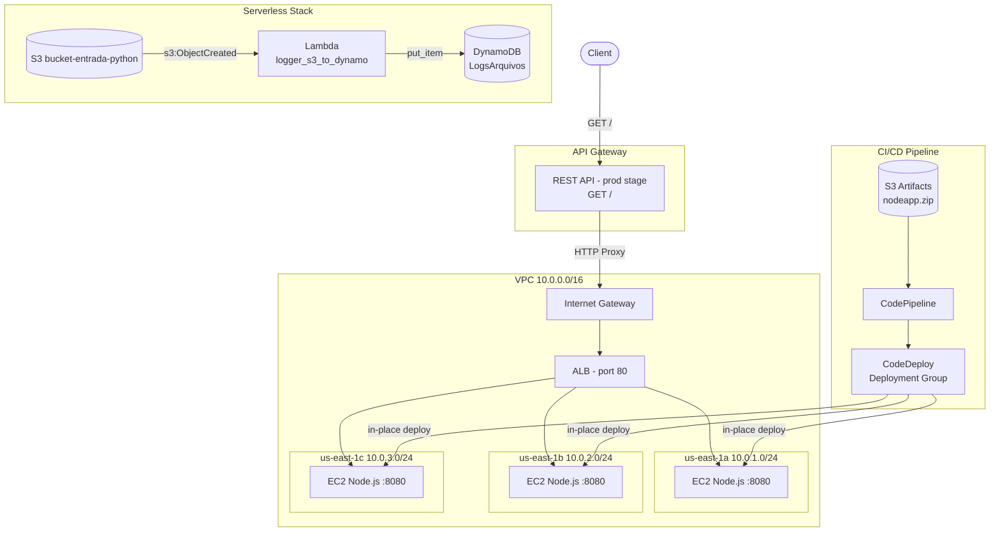

# LocalStack DevOps Training Project

Este projeto é um ambiente de treinamento focado em práticas de DevOps, utilizando **LocalStack** para emular serviços da AWS localmente, **Terraform** para Infraestrutura como Código (IaC), **Docker** para containerização e **GitHub Actions** para CI/CD.

## 🚀 Tecnologias Utilizadas

- **LocalStack**: Emulação de serviços AWS (S3, Lambda, DynamoDB, IAM, STS, EC2, ALB, API Gateway, CodeDeploy, CodePipeline) para desenvolvimento e testes locais sem custos.
- **Terraform**: Gerenciamento automatizado da infraestrutura AWS.
- **Python (3.11)**: Linguagem utilizada para a função Lambda, utilizando a biblioteca `boto3`.
- **Node.js**: Servidor HTTP simples rodando em um cluster EC2 gerenciado por Auto Scaling e balanceado por um ALB.
- **Docker**: Containerização da aplicação Node.js (útil para testes locais).
- **GitHub Actions**: Pipeline de CI/CD para automação de build e push da imagem Docker.

## 🏗️ Arquitetura do Sistema

O projeto implementa uma arquitetura moderna, combinando serverless, cluster EC2 e CI/CD:

- **API Gateway**: expõe uma API REST pública (GET /) que encaminha requisições para o ALB.
- **Application Load Balancer (ALB)**: distribui o tráfego para 3 instâncias EC2 (Node.js) em subnets distintas.
- **Auto Scaling Group (ASG)**: mantém 3 instâncias EC2 rodando Node.js (resposta: `hello world`).
- **CodePipeline + CodeDeploy**: pipeline CI/CD para deploy automatizado do Node.js nas instâncias EC2.
- **S3 Bucket (`bucket-entrada-python`)**: ponto de entrada para eventos serverless.
- **AWS Lambda (`logger_s3_to_dynamo`)**: processa eventos do S3 e grava logs no DynamoDB.
- **DynamoDB (`LogsArquivos`)**: armazena logs dos arquivos processados.

### Diagrama da Arquitetura



## 📂 Estrutura de Arquivos

```text
.
├── .github/workflows/      # Definições de CI/CD (GitHub Actions)
│   └── deploy-image.yml    # Pipeline para build e push da imagem Docker
├── localstack_data/        # Dados persistentes do LocalStack
├── dockerfile              # Instruções para criação da imagem do servidor Node.js
├── index.py                # Código-fonte da função AWS Lambda (Python)
├── main.tf                 # Configurações de infraestrutura do Terraform
├── server.js               # Código-fonte do servidor Node.js
├── function.zip            # Pacote da função Lambda para deploy
└── terraform.tfstate       # Estado atual da infraestrutura gerenciada pelo Terraform
```

## ⚙️ Como Executar

### Pré-requisitos

- Docker & Docker Compose
- Terraform
- AWS CLI (opcional, para testes manuais)

### Passo a Passo

1.  **Iniciar o LocalStack**:
    Certifique-se de que o LocalStack está rodando (via Docker Compose ou CLI).

2.  **Provisionar Infraestrutura**:

    ```bash
    terraform init
    terraform apply -auto-approve
    ```

3.  **Subir o Servidor Node.js**:
    ```bash
    docker build -t server-node .
    docker run -p 8080:8080 server-node
    ```

### Deploy do Node.js via Pipeline

1. Faça build do pacote de deploy:
   ```bash
   zip nodeapp.zip server.js appspec.yml scripts/
   aws --endpoint-url=http://localhost:4566 s3 cp nodeapp.zip s3://codepipeline-artifacts-nodeapp/nodeapp.zip
   ```
2. O pipeline detecta o novo artefato e faz o deploy automático nas 3 instâncias EC2.

## Testar o Fluxo Serverless

Faça o upload de um arquivo para o bucket S3 via AWS CLI apontando para o LocalStack:

```bash
aws --endpoint-url=http://localhost:4566 s3 cp arquivo.txt s3://bucket-entrada-python/
```

Verifique os logs da Lambda e a tabela no DynamoDB para confirmar o processamento.

---

Este projeto demonstra a integração entre desenvolvimento de software, infraestrutura moderna e automação DevOps.
