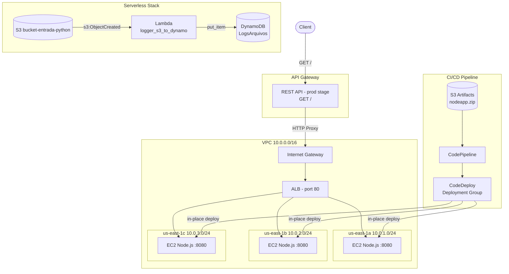

```mermaid
flowchart TD
    USER(["Client"])

    subgraph APIGW_GROUP["API Gateway"]
        APIGW["REST API - prod stage<br/>GET /"]
    end

    subgraph VPC["VPC 10.0.0.0/16"]
        IGW["Internet Gateway"]
        ALB["ALB - port 80"]

        subgraph AZ_A["us-east-1a 10.0.1.0/24"]
            EC2_A["EC2 Node.js :8080"]
        end
        subgraph AZ_B["us-east-1b 10.0.2.0/24"]
            EC2_B["EC2 Node.js :8080"]
        end
        subgraph AZ_C["us-east-1c 10.0.3.0/24"]
            EC2_C["EC2 Node.js :8080"]
        end
    end

    subgraph CICD["CI/CD Pipeline"]
        S3_ART[("S3 Artifacts<br/>nodeapp.zip")]
        PIPELINE["CodePipeline"]
        CODEDEPLOY["CodeDeploy<br/>Deployment Group"]
    end

    subgraph SERVERLESS["Serverless Stack"]
        S3_ENT[("S3 bucket-entrada-python")]
        LAMBDA["Lambda<br/>logger_s3_to_dynamo"]
        DYNAMO[("DynamoDB<br/>LogsArquivos")]
    end

    USER -->|"GET /"| APIGW
    APIGW -->|"HTTP Proxy"| IGW
    IGW --> ALB
    ALB --> EC2_A
    ALB --> EC2_B
    ALB --> EC2_C

    S3_ART --> PIPELINE
    PIPELINE --> CODEDEPLOY
    CODEDEPLOY -->|"in-place deploy"| EC2_A
    CODEDEPLOY -->|"in-place deploy"| EC2_B
    CODEDEPLOY -->|"in-place deploy"| EC2_C

    S3_ENT -->|"s3:ObjectCreated"| LAMBDA
    LAMBDA -->|"put_item"| DYNAMO
```
